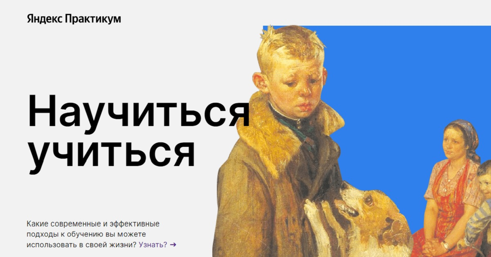
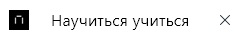
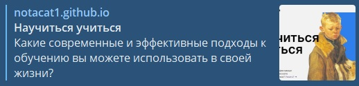
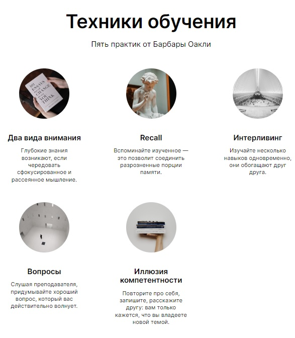
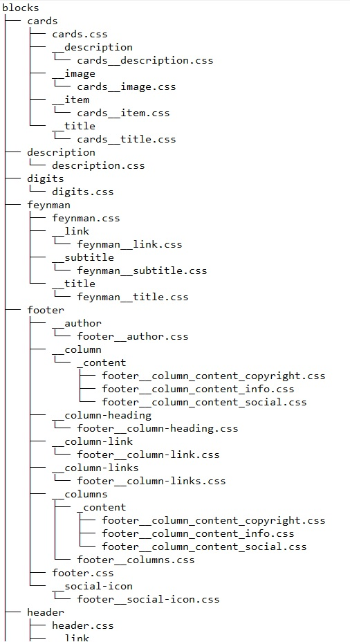
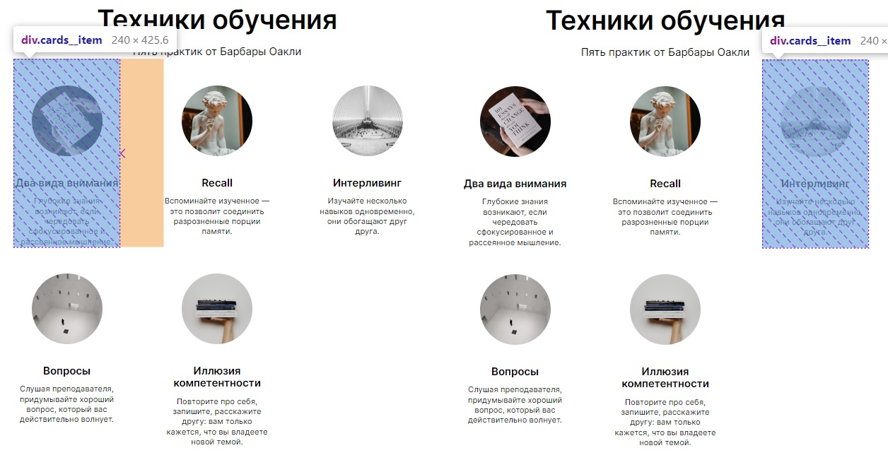
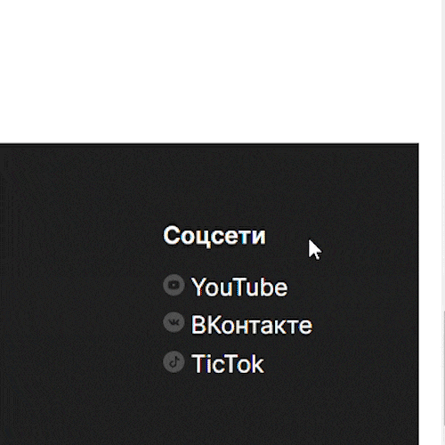
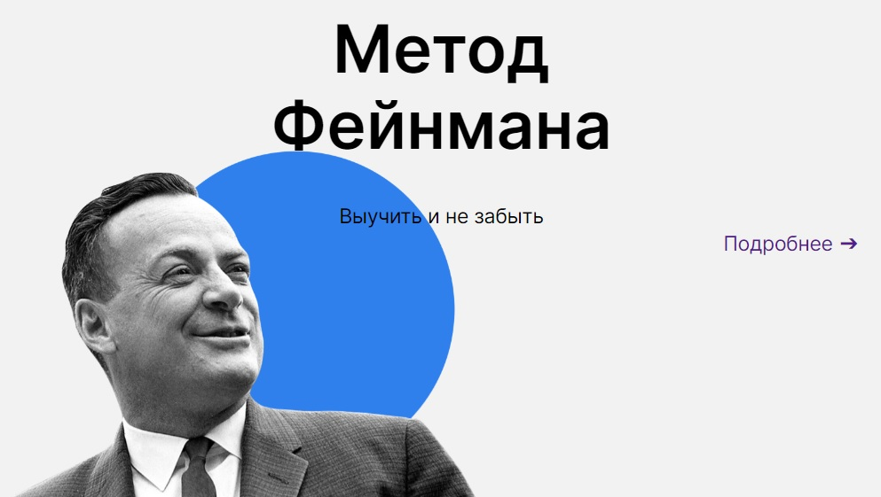
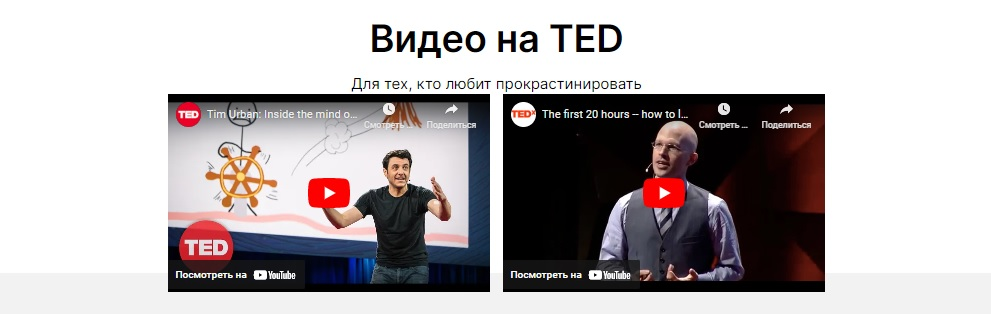

# Научиться учиться

Данный WEB сайт является сборником различных эффективных подходов к обучению, которые пользователь может использовать в своей повседневной жизни.
____

## Описание проекта:

Данный WEB сайт является сборником различных эффективных подходов к обучению, которые пользователь может использовать в своей повседневной жизни. Здесь собраны все основные приемы интернет-обучения от простых до очень сложных.
Все, что вы можете сделать с помощью интернета, все, что может сделать вас более успешным – собрано здесь.
Вы можете использовать любой из методов, который вам нравится, в зависимости от того, где и когда вы хотите получить информацию.

## Реализованный функционал:
### 1. Favicon
**Favicon** — это иконка, которая отображается во вкладке браузера перед названием сайта.



```html
<link rel="apple-touch-icon" href="./images/favicon/apple-touch-icon.png">
<link rel="icon" href="./images/favicon/favicon.ico" sizes="16x16" type="image/x-icon">
<link rel="manifest" href="./images/favicon/manifest.json">
<link rel="yandex-tableau-widget" href="./images/favicon/tableau.json">
```

### 2. Open Graph
**Open Graph** — это словарь семантической разметки данных. Он позволяет контролировать превью, которое формируется при публикации ссылки на сайт в социальных сетях, и передавать информацию другим интернет-сервисам.



```html
<meta property="og:type" content="website">
<meta property="og:title" content="Научиться учиться">
<meta property="og:description" content="Какие современные и эффективные подходы к обучению вы можете использовать в своей жизни?">
<meta property="og:image" content="https://i.yapx.ru/V6iBg.jpg">
```

### 3. Подключение шрифтов
Одним из способов коммуникации с пользователем является типографика. Хороший шрифт на сайте создает настроение, акцентирует внимание человека на важных элементах, его легко читать и он также является отдельным элементом дизайна.

```css
/* Подключение семейство шрифтов Inter */
/* Обычное начертание */
@font-face {
  font-family: 'Inter';
  src: url(./Inter-Regular.woff2) format('woff2'),
       url(./Inter-Regular.woff) format('woff');
}

/* Полужирный */
@font-face {
  font-family: 'Inter';
  src: url(./Inter-SemiBold.woff2) format('woff2'),
       url(./Inter-SemiBold.woff) format('woff');
  font-weight: 600;
}

/* Жирный */
@font-face {
  font-family: 'Inter';
  src: url(./Inter-Bold.woff2) format('woff2'),
       url(./Inter-Bold.woff) format('woff');
  font-weight: bold;
}
```

### 4. Flexbox
**Flexbox** — система адаптируемых блоков для создания быстрого создания сложных и гибких макетов WEB макетов.



### 5. Методология БЭМ
БЭМ (Блок, Элемент, Модификатор) — компонентный подход к веб-разработке. В его основе лежит принцип разделения интерфейса на независимые блоки. Он позволяет легко и быстро разрабатывать интерфейсы любой сложности и повторно использовать существующий код, избегая «Copy-Paste».

```html
<!-- Секция, блок khan -->
<section class="khan">
  <div class="khan__container">
    <h3 class="khan__author">Салман Хан</h3>
    <h2 class="khan__title">Весь мир — школа</h2>
    <p class="khan__quote">
      Страсть и новаторство Сала Хана меняют процесс обучения миллионов студентов по всему миру. Книгу «Весь мир — школа» 
      нужно прочитать всем, кто занимается образованием — так учащиеся повсюду смогут получить навыки и знания, которые 
      приносят успех в школе, карьере и жизни.
    </p>
    <h3 class="khan__quote-author">Джордж Лукас</h3>
    <h4 class="khan__quote-author-subline">Кинорежиссер, продюсер</h4>
    <div class="khan__book-container">
      <div class="khan__book-pic">
        
      </div>            
      <a class="khan__buy-link" target="_blank" href="https://www.ozon.ru/product/ves-mir-shkola-preobrazovannoe-obrazovanie-162999126/?oos_search=false&sh=c57824XVXg">Купить книгу ➔</a>
    </div>
  </div>
</section>
```

### 6. Файловая структура Nested
Классическая схема организации файловой структуры БЭМ-проектов:
- Блоку соответствует одна директория.
- Код модификаторов и элементов находится в отдельных файлах.
- Файлы модификаторов и элементов хранятся в отдельных директориях.
- Директория блока является корневой для поддиректорий его элементов и модификаторов.
- Имена директорий элементов начинаются с двойного подчеркивания (__).
- Имена директорий модификаторов начинаются с одинарного подчеркивания (_).



### 7. Идентификатор
**Идентификатор** (называемый также «ID селектор») определяет уникальное имя элемента, которое используется для изменения его стиля и обращения к нему через скрипты.

```html
<!-- Секция, блок techniques -->
<section class="techniques" id="techniques">
```

**Ссылка-якорь** — это обычная ссылка, в адресе которой используется символ #, после которого следует идентификатор элемента.

```html
<a class="header__link" href="#techniques">Узнать? ➔</a>
```


### 8. Псевдоклассы
**Псевдокласс** — это селектор, который выбирает элементы, находящиеся в специфическом состоянии, например, они являются первым элементом своего типа, или на них наведён указатель мыши.



```css
/* Карточка */
.cards__item {
  margin-right: 100px;
  width: 240px;
}

/* Каждый 3-ий элемент .cards__item */
.cards__item:nth-child(3n) {
  margin-right: 0; /* убрать отступ справа */
}
```


```css
.footer__column-link {
  margin-bottom: 10px;
  line-height: 18px;
  font-size: 18px;
  font-weight: normal;
  text-decoration: none;
  transition: opacity .5s ease;
  opacity: 1;
}

.footer__column-link:Link {
  color: #fff;
}

.footer__column-link:last-of-type {
  margin-bottom: 0;
}

.footer__column-link:hover {
  opacity: .7;
}
```
***:Link** применяется к ссылкам, которые еще не посещались пользователем.*

***:last-of-type** задает правила стилей для последнего элемента в списке дочерних элементов своего родителя.*

***:hover** используется для стилизации различных элементов при наведении на них указателя мыши.*
### 9. Позиционирование элементов
**Позиционирование** позволяет вам изымать элементы из нормального потока макета документа и заставить их вести себя по-другому; например, располагаться друг на друге или всегда оставаться на одном и том же месте внутри окна просмотра браузера.



### 10. iframe (API YouTube)
**IFrame** — это кадр внутри кадра. Это компонент HTML-элемента, который позволяет встраивать документы, видео и интерактивные медиафайлы на страницу.



```html
<iframe width="100%" height="100%" src="https://www.youtube.com/embed/arj7oStGLkU" title="YouTube video player" frameborder="0" allow="accelerometer; autoplay; clipboard-write; encrypted-media; gyroscope; picture-in-picture; web-share" allowfullscreen></iframe>
```

### 11. Анимации
**Анимации** — важная часть создания привлекательных веб-приложений и сайтов. Пользователи ожидают высокую отзывчивость и интерактивность.


```css
/* Описание анимации */
@keyframes rotation {
  from {
      transform: rotate(0deg);
  }
  to {
      transform: rotate(360deg);
  }
}

/* Треугольник */
.kaufman__triangle {
  position: absolute;
  right: -210px;
  top: 0;
  width: 877px;
  height: 877px;
  background-image: url(../../../images/kaufman/kaufman-triangle.svg);
  background-repeat: no-repeat;
  background-size: contain;
  background-position: center center;
  animation: rotation 20s linear infinite;
  z-index: 1;
}
```

### 12. Трансформации 
**Трансформации** определяют, каким станет тот или иной элемент.


```css
.footer__column-link {
  transition: opacity .5s ease;
  opacity: 1;
}

.footer__column-link:hover {
  opacity: .7;
}
```

***:hover** используется для стилизации различных элементов при наведении на них указателя мыши.*
____

## Используемые технологии:

### 1. Normalize.css

Normalize.css позволяет браузерам отображать все элементы более последовательно и в соответствии с современными стандартами. Он точно нацелен только на те стили, которые нуждаются в нормализации.
____
